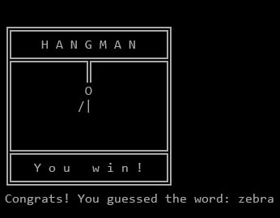
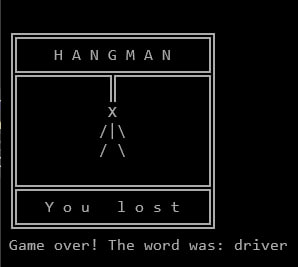

# 🪓 Hangman ASCII Game (C++)

A console-based implementation of the classic "Hangman" game, written in C++ using an object-oriented approach. The game features ASCII-style graphics and randomly selects words from a file.

## 📦 Features

- English language support (only English for now).
- ASCII art for game win/lose.
- Tracks previously guessed letters.
- Display of remaining attempts and current word state.
- Random word selection using `mt19937`.

## 🎮 Gameplay Preview





## 🧠 Project Structure

### `Art`  
Responsible for ASCII graphics display. Shows the hangman state, win/lose messages.

### `Game`  
Main game loop and logic:
- input handling;
- tracking attempts and incorrect guesses;
- checking for win/lose conditions;
- printing game state and interacting with other components (`Art`, `Word`, `Utils`).

### `Word`  
Handles the target word logic:
- original and masked word (`_` instead of letters);
- letter guessing and validation;
- tracking already guessed letters.

### `WordLoad`  
Loads a list of words from a text file and selects one randomly using `std::mt19937`.

### `Menu`  
Designed for language selection when loading words. Currently supports **only English** due to locale limitations.

## 🛠️ Building the Project

Requirements:

- g++ or clang++ with C++17 or later
- Optional: make or cmake

### Example Compilation:

```bash
g++ -std=c++17 -I include main.cpp source/*.cpp -o Hangman.exe
```

### Run:

```bash
./Hangman
```

## 📁 Folder Structure

```
Hangman/
├── include/
│   ├── Art.h
│   ├── Game.h
│   ├── Utils.h   
│   ├── Word.h
│   ├── WordLoad.h
│   └── Utils.h
├── source/
│   ├── Art.cpp
│   ├── Game.cpp
│   ├── Word.cpp
│   ├── WordLoad.cpp
│   └── Utils.cpp
├── data/
│   └── word_en.txt
├── main.cpp
└── README.md
```

## 🔤 Language Support

Currently, only the **English** dictionary (`word_en.txt`) is supported. Plans to support:
- 🇺🇦 Ukrainian
- 🇷🇺 Russian

Locale-related issues are preventing full implementation at this stage.

## 💡 Future Plans

- Multilanguage and locale support.
- Difficulty modes.
- Enhanced ASCII graphics.
- GUI support (e.g., with Qt).
